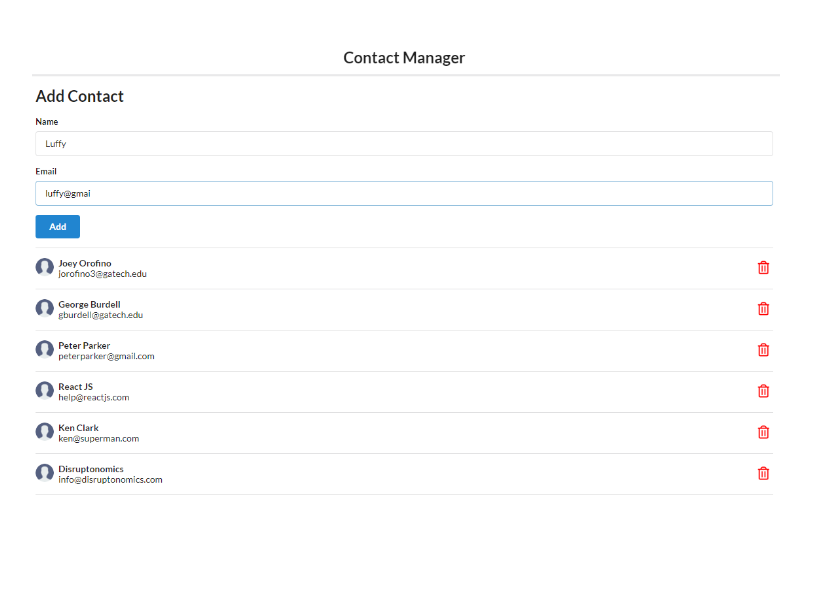

<div align="center">

  

  <h1>Contact Nanager</h1>


<!-- Badges -->
<div>
  
</div>

  
  
  
  


</div>


<!-- About the Project -->
## :star2: About the Project
  <p>
    Full functional contact manager that allows users to add and remove contacts. 
  </p>


This is fully developed with React and CSS

- 👨‍💻 &nbsp;This uses React components, hooks, state, and JSX
- :iphone: &nbsp; Fully adaptive. Well designed for both larger and smaller screen!
- 🌱 &nbsp; Uses local storing and fetching to archieve contacts! 


<!-- Run Locally -->
### :running: Run Locally

Clone the project

```
  git clone https://github.com/jorofino3/restaurant-template
```

Go to the project directory

```
  cd app
```

Install dependencies

```
  npm install
```

Start the server

```
  npm start
```

<!-- Contact -->
## :handshake: Contact
<div>
  </a> </br>
<a href="https://www.linkedin.com/in/joeyorofino/">
  
<a href="mailto:jorofino3@gatech.edu">
  
<a/>
    
  </div>
